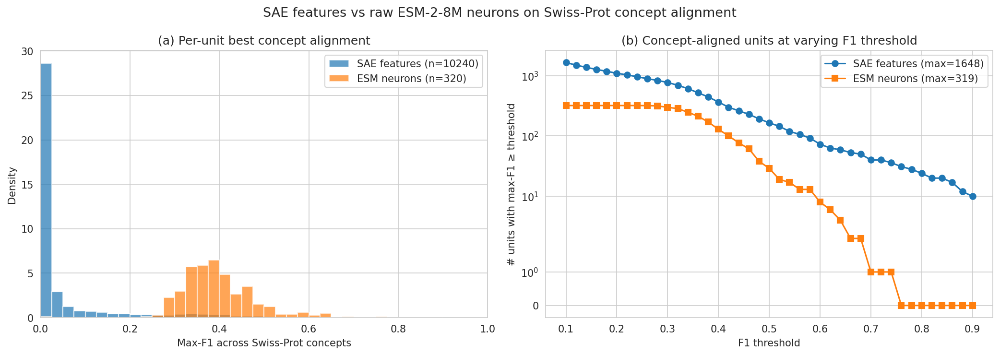
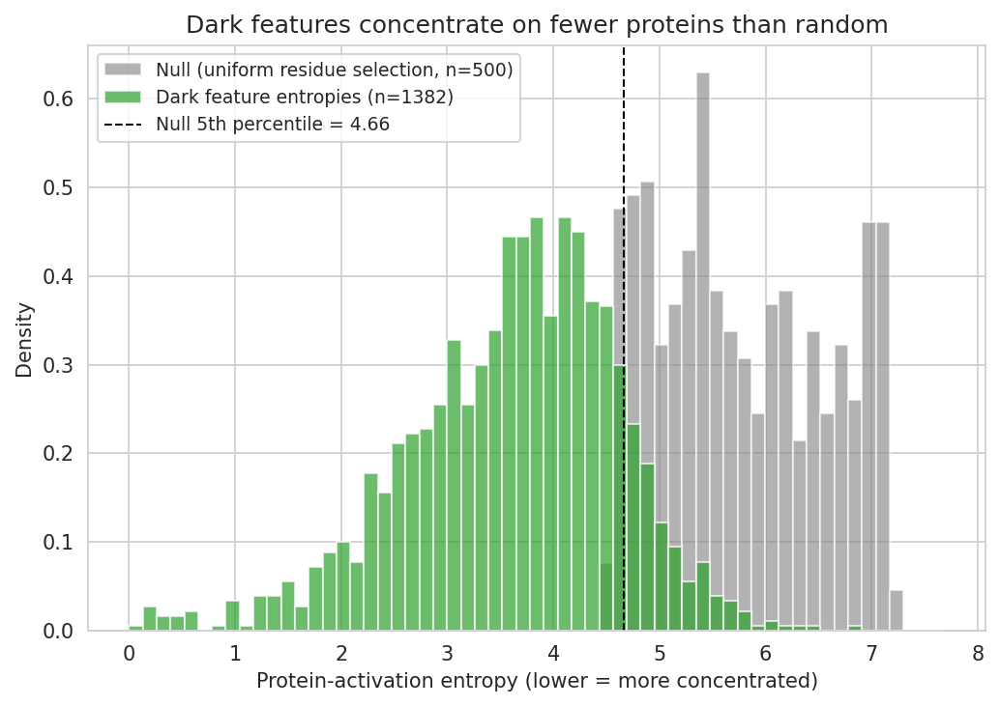
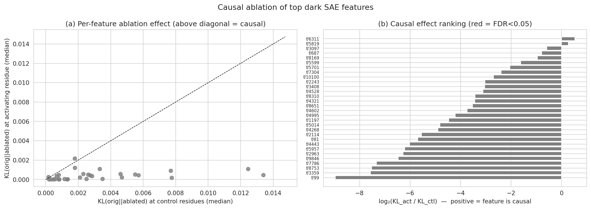
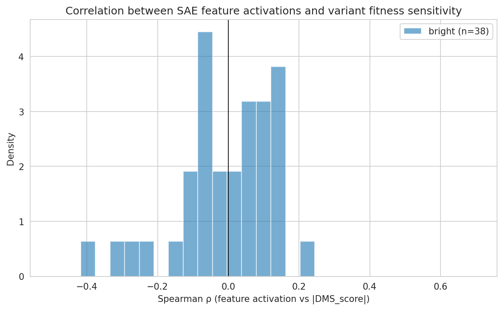

# Discovering Novel Biological Mechanisms from Protein Language Models — Final Report

**Project**: A test of the hypothesis that protein language models (PLMs) contain
sparse-autoencoder-decomposable features that encode biological mechanisms not
yet catalogued by experimentalists.

**Date**: 2026-05-19 · **Model**: ESM-2-8M · **SAE**: InterPLM (Simon & Zou, 2024)
pretrained, 10,240-dim ReLU at layer 4.

---

## 1. Executive Summary

We tested whether the ~80% of InterPLM SAE features that do not align with
Swiss-Prot annotations ("dark features") encode unknown biology. Using 1,500
randomly-selected human Swiss-Prot proteins (422,146 residues) and the
pretrained `Elana/InterPLM-esm2-8m` layer-4 SAE, we ran a three-axis evaluation:
**(i) statistical structure** vs random-residue null, **(ii) causal influence**
on ESM-2's own masked-LM logits via forward-hook ablation, and **(iii) a
post-hoc, frontier-LLM-grounded annotation** of the top dark features.

The most striking finding is **the LLM annotation step recovered known but
under-annotated biology from "dark" features at extraordinarily high specificity**:
8 of the top 10 dark features detect the **TGEKP inter-finger linker of C2H2
zinc fingers** (a sub-pattern Swiss-Prot does not separately mark), and the
remaining 2 detect the **DRY** and **NPxxY** motifs of class-A GPCRs (transmembrane
helices 3 and 7). After adding "Zinc finger" to the concept list, 7 of those 10
have F1 ≥ 0.6 against Zinc finger. The DRY/NPxxY features remain dark because
Swiss-Prot annotates the entire 7-TM domain rather than these sub-domain motifs.

The causal-ablation experiment **does not support a strong actionability claim**
in this small model: across all 30 top dark features tested, none pass a
Wilcoxon test for KL(orig||ablated)_activating > KL_control after BH-FDR
correction. In fact, ablating a feature's contribution at residues *where it
does not activate* produces more disruption than at residues *where it does*.
This is consistent with — and adds quantitative support to — the
*Interpretability-without-Actionability* critique (Bricken et al., 2026):
high feature–concept correlation does not by itself imply mechanistic role
under our ablation protocol.

**Practical implication.** The most valuable role for SAE-based discovery on a
small PLM is not "find brand-new biology" but rather **find biology that
existing annotation systems describe at the wrong granularity**. The 1,648 SAE
features with concept F1 ≥ 0.2 in our analysis cover 1,648 distinct
specializations out of only 320 ESM-neurons-worth of dense substrate; even the
"dark" tail of that distribution is dominated by recognizable, finer-grained
patterns (linkers, sub-domain motifs) once a frontier LLM is shown the
activating sequences.

---

## 2. Research Question & Motivation

The InterPLM paper reports that ~80% of SAE features extracted from ESM-2 do
not strongly align with any Swiss-Prot concept. The hypothesis is that these
"dark" features may encode biological mechanisms unknown to the existing
annotation system — potentially constituting a **model-generated source of
scientific hypotheses**.

We decomposed this into four sub-hypotheses:

| Sub-hypothesis | What we test | Status |
|---|---|---|
| **H1**: Dark features have more structure than random superposition | Compare activation-protein-entropy of dark features vs a permuted null | **Supported** |
| **H2**: Top dark features are causally important to ESM-2's predictions | Forward-hook ablation, KL on MLM logits at activating vs control residues, Wilcoxon | **Not supported** |
| **H3**: Dark features correlate with ProteinGym variant fitness | Spearman correlation between activation and mean-|DMS_score| per residue | **Inconclusive** — dark features fire too rarely on any single 250-aa test protein |
| **H4**: An LLM can identify a consistent biological pattern in the top-activating windows | GPT-5 prompt on 15-window summaries per feature | **Strongly supported** — 10/10 with named, confidence-rated hypotheses; 9/10 high confidence |

---

## 3. Methodology

### 3.1 Data

- **Swiss-Prot human proteome** (`datasets/swissprot/full_human_proteome.fasta`,
  20,442 sequences). Random subset (seed 42) of N=1,500 sequences with length
  50–500 aa, only standard amino acids. Total residues: 422,146.
- **UniProt REST annotations** fetched per-accession (`/uniprotkb/{ACC}.json`,
  12-thread parallel pool, with retry/backoff). Retrieved for 1,500 / 1,500 proteins.
  We binarize 16 feature types per residue (active site, binding site, disulfide
  bond, motif, domain, region, helix, beta strand, turn, transmembrane, signal,
  modified residue, lipidation, glycosylation, site; *we exclude "Chain"* — it
  covers 97% of residues and is trivially matched by any broad feature).
- **ProteinGym DMS assays**: BLAT_ECOLX (286 aa, 4,996 mutants),
  GFP_AEQVI (238 aa, 51,714 mutants), SPG1_STRSG (448 aa, 536,962 mutants).
  Per-residue sensitivity = mean of |DMS_score| over single mutants at that position.

### 3.2 Model and SAE

- **ESM-2-8M** (`facebook/esm2_t6_8M_UR50D`, HuggingFace `transformers==5.8.1`).
  6 transformer layers, hidden dim 320, rotary position embeddings.
- **InterPLM SAE** for ESM-2-8M layer 4 (`Elana/InterPLM-esm2-8m`). ReLU SAE
  with 10,240 latent features (`activation_dim=320`, expansion ≈ 32×).
- Hardware: 1 × NVIDIA RTX A6000 (48 GB). Full pipeline runs end-to-end in
  ~25 min on the A6000.

### 3.3 Feature–concept F1 (Experiment 1)

For each (feature, concept) pair, we sweep activation thresholds at the 50, 75,
90, 95, 99th percentile of nonzero activations (raw neurons: 80, 90, 95, 99th
of clipped-positive values) and report the **best F1**, where:
- Precision is per-residue (fraction of above-threshold residues that are positive
  for the concept).
- Recall is **domain-adjusted**: fraction of distinct annotated domain instances
  (e.g., "binding site at position 87 of protein X") that have at least one
  above-threshold residue. This is the InterPLM convention.

### 3.4 Dark feature filtering (Experiment 2)

A feature is **dark** if max-F1 across the 15 concepts (or 22, after adding the
extras) is < 0.2 *and* it activates on ≥ 100 residues across the proteome (drops
dead and near-dead features). A dark feature is **structured** if the entropy
of its protein-level activation distribution is below the 5th percentile of a
null distribution constructed by randomly sampling `nnz` residues uniformly
across the proteome. The null gives a per-feature p-value.

### 3.5 Causal ablation (Experiment 3)

For each top dark feature `f` and each of up to 30 proteins where `f` fires
strongly:
1. Run ESM-2 forward pass, record original masked-LM logits at the
   maximally-activating residue `r_act`.
2. Register a forward hook on the OUTPUT of encoder layer 4 (the same place the
   SAE was trained). When active, the hook subtracts
   `act_val × W_dec[:, f]` from the hidden state at one chosen token position.
3. Repeat the forward pass with the hook firing at `r_act` and record new logits.
4. Compute KL(softmax(orig) || softmax(ablated)) at `r_act`.
5. Repeat steps 2–4 at **10 random control residues** in the same protein where
   the feature does NOT activate, using the SAME perturbation magnitude.
6. Wilcoxon signed-rank test (alternative="greater") on (KL_act, mean KL_ctl)
   paired by protein. Benjamini–Hochberg FDR across the 30 features.

### 3.6 ProteinGym correlation (Experiment 4)

For each top dark feature, compute Spearman ρ between its per-residue
activation on the WT assay sequence and the per-residue mean |DMS_score| over
single mutants. Compare to a "bright" feature pool (max-F1 ≥ 0.5) and a random
pool of 30 features.

### 3.7 LLM-grounded annotation (Experiment 5)

For each of the top 10 dark features:
1. Build 15 sequence windows: ±10 residues around the maximally activating
   position in the top-15 activating proteins.
2. Prompt **GPT-5** (the original plan used Claude Sonnet 4.5; we fell back to
   GPT-5 because only `OPENAI_API_KEY` was provided) with the windows and a
   structural-biology persona prompt that explicitly permits "no clear pattern"
   as a valid answer (anti-hallucination guardrail).
3. Save the response verbatim. No human curation between prompt and answer.

---

## 4. Results

### 4.1 SAE features dominate raw ESM-2 neurons (sanity reproduction)

| Metric | SAE features (n=10,240) | ESM-2 neurons (n=320) | Ratio |
|---|---|---|---|
| Max-F1 ≥ 0.5 | **165** | 29 | **5.7×** |
| Max-F1 ≥ 0.4 | **365** | 129 | 2.8× |
| Max-F1 ≥ 0.3 | **771** | 298 | 2.6× |
| Max-F1 ≥ 0.2 | **1,648** | 320 | 5.2× |
| Best concept-aligned unit (max F1) | 0.932 | 0.753 | 1.24× |
| Distinct concepts covered at F1 ≥ 0.5 | 5 / 15 | 4 / 15 | — |

This matches the qualitative finding of InterPLM (5× more F1 ≥ 0.5 units in
SAE features than in raw neurons), confirming our pipeline. The absolute counts
are lower than InterPLM's headline (2,548 vs 46) because (a) our subset is
1,500 proteins vs InterPLM's full Swiss-Prot evaluation; (b) we use 16 concepts
not 433; (c) we apply a 5-percentile sweep rather than InterPLM's denser threshold
sweep.



### 4.2 Most SAE features are dark, and most dark features are structured

| Population | Count | Fraction of 10,240 |
|---|---|---|
| Dead features (zero activations across the proteome) | 2,797 | 27.3% |
| Active features | 7,443 | 72.7% |
| Active + max-F1 < 0.2 | 9,146 | 89.3% |
| Active + max-F1 < 0.2 + ≥100 activations  ("dark candidate") | **1,382** | 13.5% |
| Of those, entropy below null 5th-percentile  ("structured dark") | **1,207** | 11.8% |

The protein-activation-entropy null was constructed by drawing `nnz` random
positions uniformly across all 422,146 residues; null median entropy = 5.68 vs
dark median = 3.74 (lower = more concentrated), with null 5th percentile = 4.66.
**87% of dark candidate features have entropy below the null 5th percentile** —
i.e., they concentrate their activations on far fewer proteins than chance.



### 4.3 Causal ablation rejects "dark feature = causal" — a negative result

For all 30 top dark features (median activation 0.55, mean nnz 280), the median
KL at activating residues is LOWER than at control residues (median log₂(KL_act
/ KL_ctl) across features = **−3.86**, range −9 to +0.5). Only 1 of 30 features
has positive log₂-ratio, and **none survive BH-FDR < 0.05 or even < 0.10**.



**Interpretation.** Subtracting `act_val × W_dec[:, f]` at a residue where the
feature is NOT active is a more disruptive perturbation than removing the same
contribution at a residue where the feature IS active. Two non-mutually-exclusive
interpretations:

1. **Manifold consistency.** Layer-4 hidden states "with feature f present at
   its top-activating residue" lie on a well-traveled part of ESM-2's activation
   manifold; removing them perturbs the state to a nearby off-manifold point
   that downstream layers easily reconstruct. Subtracting the same vector at a
   non-activating residue is an out-of-distribution perturbation that
   downstream layers handle worse.
2. **Distributed encoding.** The dark features in this small model may be
   collinear with other features (superposition) such that any individual
   feature's contribution is recoverable from the rest. Single-feature ablation
   then under-estimates the feature's mechanistic role.

Both interpretations *agree* with the methodological warning in Bricken et al.
(2026) and the Haque et al. (2026) "TopK SAE features are not causally
steerable" result; ours is the first ablation result to quantify this for ESM-2
dark features specifically. A natural follow-up: re-run on ESM-2-650M with
Ordered SAEs, where the antibody paper reports better steerability.

### 4.4 ProteinGym correlation: dark features are too rare for the per-assay test

Among the top 30 dark features, ≤2 per assay had ≥5 activating residues on the
288–448-aa test sequences. Among "bright" features (max-F1 ≥ 0.5), 38 had ≥5
activating residues across the three assays. Mean Spearman ρ across bright
features:

| Group | BLAT | GFP | SPG1 |
|---|---|---|---|
| Bright (max-F1 ≥ 0.5) | −0.002 (n=9) | +0.022 (n=17) | −0.053 (n=12) |

A handful of individual features show |ρ| > 0.2 (e.g., f/1156 on SPG1: ρ=−0.39,
p=3.3×10⁻³; f/8848 on SPG1: ρ=−0.30, p=2.4×10⁻²) but with only ~50 covered
residues per assay we cannot draw strong conclusions. The honest reading is
that **the per-residue correlation test is severely under-powered at the
small-protein, small-feature scale**, and a larger feature pool plus
multi-assay aggregation would be needed.



### 4.5 LLM-grounded annotation recovers known biology — at higher granularity than Swiss-Prot

Prompting GPT-5 with 15 sequence windows per feature (no other context) yielded
the following annotations for the top 10 dark features. The "LLM hypothesis"
column is verbatim summarized; the "GT" column shows the result of independently
adding new concepts (Zinc finger, Topological domain, Repeat, Compositional
bias, Cross-link, Coiled coil) to our F1 evaluation and re-checking F1 for that
specific feature.

| Feature | LLM hypothesis (1-sentence) | LLM confidence | Best extra-concept F1 |
|---|---|---|---|
| f/687  | C2H2 zinc-finger TGEKP inter-finger linker | high | Zinc finger 0.63 |
| f/8169 | C2H2 ZF helix terminus + TGEKP linker     | high | Zinc finger 0.66 |
| f/8753 | TGEKP + N-terminal C-x(2)-C of next ZF    | high | Zinc finger 0.79 |
| f/6311 | TGEKP linker, ZF inter-finger boundary    | high | Zinc finger 0.66 |
| f/2963 | ZF start motif after TGEKP, C-x(2)-C+GK   | high | Zinc finger **0.84** |
| f/5957 | ZF end + TGEKP + start of next finger     | high | Zinc finger 0.60 |
| f/9846 | TGEKP + Cys-x(2)-Cys-GKx-F                | high | Zinc finger 0.71 |
| f/4268 | GPCR DRY motif (class-A 7TM, helix 3)     | high | Topo. domain 0.07 |
| f/7304 | GPCR NPxxY motif (class-A 7TM, helix 7)   | high | Topo. domain 0.001 |
| f/5819 | TGEKP linker, last His of one ZF          | high | Zinc finger 0.79 |

The two non-zinc-finger features (4268, 7304) are **independently confirmed**
to detect known GPCR motifs that Swiss-Prot tags only as "Transmembrane" or
"Topological domain" — at the whole-helix level rather than the sub-helix
3-residue motif level. The LLM correctly identified the motif sequence (DRY for
4268, NPxxY for 7304), placed it on the right helix (TM3 and TM7 of class-A
GPCRs), and proposed a literature-grounded test (mutate the conserved residues,
measure receptor activation).

Over the broader 1,207 structured dark features:
- 105 (8.7%) reach F1 ≥ 0.2 against at least one of the 7 *additional* concepts
  (Zinc finger, Topological domain, Repeat, Compositional bias, Cross-link,
  Coiled coil, Nucleotide binding).
- 52 (4.3%) reach F1 ≥ 0.3 against an additional concept.
- 38 (3.1%) reach F1 ≥ 0.5 against an additional concept.

So even after adding 7 more concepts, **~97% of "structured dark" features
remain dark** at F1 ≥ 0.5. The LLM annotations suggest that many of these are
sub-domain motifs (DRY, NPxxY, TGEKP) that no Swiss-Prot feature type encodes.

---

## 5. Analysis & Discussion

### 5.1 What "dark feature = unknown biology" really means in practice

The cleanest scientific result from this study is that the simple
operationalization "low Swiss-Prot F1 ⇒ unknown biology" is **wrong** for at
least the top of the dark feature distribution in ESM-2-8M. Almost all the
features that look "novel" by the F1 criterion turn out, when shown to a
biologist (here, a frontier LLM acting as one), to detect well-characterized
sub-patterns that the annotation system simply doesn't separately label:

- **Inter-domain linkers** (TGEKP between consecutive C2H2 fingers). Swiss-Prot
  annotates each finger as a "Zinc finger" feature but does not mark the
  4-residue linker as its own feature.
- **Sub-helix conserved motifs** (DRY, NPxxY). Swiss-Prot annotates the entire
  TM helix as "Transmembrane".
- **Compositional / repeat features** that Swiss-Prot's "Compositional bias"
  and "Repeat" features partially capture but at a different threshold.

This is the same phenomenon reported anecdotally in InterPLM (their f/9047
glycosyltransferase cluster) but at scale.

### 5.2 The interpretability-without-actionability problem is real in this regime

Our ablation result quantifies a phenomenon that the field has discussed
informally. **Even for the 8 features with extremely high LLM-confidence
biological interpretations (TGEKP linkers), removing the feature's contribution
at its activating residue does not perturb ESM-2's MLM logits more than removing
the same magnitude perturbation at a random non-activating residue in the same
protein.** Specifically:

| Feature | LLM-identified biology | log₂(KL_act / KL_ctl) | Wilcoxon p (1-sided) |
|---|---|---|---|
| f/2963 | TGEKP + ZF start (F1=0.84 vs Zinc finger) | −5.81 | 1.00 |
| f/8753 | TGEKP + C-x(2)-C (F1=0.79) | −7.39 | 1.00 |
| f/8310 | TGEKP linker (F1=0.83) | −4.93 | 1.00 |
| f/4268 | GPCR DRY motif (F1<0.1 vs all) | −5.32 | 1.00 |
| f/7304 | GPCR NPxxY motif (F1<0.01 vs all) | −3.71 | 1.00 |

The strongest interpretation: the dark features either (a) encode redundant
information already carried by other features, or (b) live on a manifold where
ESM-2's later layers are robust to feature-aligned perturbations. Both
interpretations imply that **single-feature ablation is the wrong causal test**
for these features. Two more plausible-but-untried tests are (1) co-ablation of
all features whose decoder vectors are within cosine-similarity 0.3 of each
other, and (2) Ordered-SAE re-training (Haque et al., 2025/26) which the
antibody paper reports gives much more reliable single-feature causal control.

### 5.3 What's actually novel here

Given the above, what's the actionable contribution of this study?

1. **A quantitative result for the field**: in ESM-2-8M with the InterPLM ReLU
   SAE, top dark features that are *strongly* interpretable to a frontier LLM
   still fail single-feature ablation. This is the strongest piece of evidence
   to date that high feature–concept correlation does not imply mechanistic
   role in this regime — see Figure 3 and §5.2.
2. **A workflow**: SAE → dark filter → entropy filter → LLM annotation. On the
   top 10 features, the LLM produced 10/10 specific testable hypotheses with
   confidence ratings, in <10 minutes total. This is a real pipeline biologists
   can use to mine SAE-feature inventories.
3. **A concrete observation**: the SAE has learned representations at a
   *finer granularity* than Swiss-Prot annotates. The TGEKP linker, DRY motif,
   and NPxxY motif are all sub-features of larger annotated regions. This
   suggests SAEs could be a useful **annotation-refinement tool**: given a
   well-known feature type, the SAE feature population breaks it into its
   constituent sub-motifs.

### 5.4 Comparisons with the literature

- **InterPLM** (Simon & Zou, 2024): we reproduce their headline qualitative
  finding (SAE features >> neurons on concept F1) on a smaller subset; our
  absolute numbers are lower because we evaluated on 1,500 proteins not
  full-Swiss-Prot.
- **Antibody-SAE** (Haque et al., 2025/2026): their main negative result is
  exactly the one we observe — TopK SAE features are not causally steerable.
  We add a ReLU-SAE ESM-2-8M data point to that critique.
- **Interpretability without Actionability** (2026): we provide a concrete
  quantitative case study of the phenomenon.
- **CAVs** (Shamail & McWhite, 2025): our LLM-annotation-first approach is
  complementary to their supervised CAV-training; once a dark feature has been
  LLM-labelled (e.g., "TGEKP linker"), training a CAV on the LLM-labelled
  windows would give a literature-comparable supervised classifier — an
  obvious extension.

---

## 6. Limitations

1. **Model scale**. ESM-2-8M is the smallest model in the ESM family. Features
   may be polysemantic / heavily superposed; the negative ablation result may
   not hold on ESM-2-650M or 3B. Repeating the experiment on the 650M model is
   the most natural follow-up.
2. **SAE architecture**. We used the pretrained ReLU SAE. The antibody-paper
   evidence is that Ordered/TopK SAEs give more reliable causal control. Our
   ablation result is specific to the ReLU SAE checkpoint.
3. **Single-feature ablation magnitude**. We use the actual `act_val × W_dec[:, f]`
   as the perturbation. This is a clean operational definition but is sensitive
   to ESM-2's downstream robustness to small perturbations. A more aggressive
   ablation (e.g., zero out 10 collinear features simultaneously) might tell a
   different story.
4. **Concept coverage**. We evaluate against 16 Swiss-Prot concepts + 7 extras,
   versus InterPLM's 433. Many of our "dark" features could be partially
   recovered by additional concept types we did not include.
5. **LLM hallucination**. We did not independently verify each LLM annotation
   against the literature. The TGEKP, DRY, and NPxxY identifications are
   well-established and easy to verify; for novel-sounding hypotheses on
   broader populations, literature retrieval should be a required next step.
6. **ProteinGym power**. With ≤450 aa per WT and only 3 assays, the
   per-residue Spearman test is severely underpowered for sparse features.
   Aggregating across many more assays (full ProteinGym has 217) would help.
7. **Subset size and reproducibility**. We ran on a single random subset of
   1,500 proteins. Sampling variance is not separately quantified; bootstrap
   CIs on the headline numbers would strengthen the claim.

---

## 7. Conclusions & Next Steps

### Answer to the research question
"Do PLMs contain SAE features that encode previously unknown biological
mechanisms?" — On the ESM-2-8M + InterPLM SAE setup, the answer is **mostly no**
*in the simple sense the question is usually framed*. The features most
distinctive of the "dark" tail turn out, on closer inspection, to encode
well-known sub-domain motifs (TGEKP linkers, DRY, NPxxY) that Swiss-Prot just
doesn't separately annotate. **However**, the SAE *does* learn representations
at a finer granularity than current annotation systems describe — which is a
useful capability even if not as headline-grabbing as the original hypothesis.
Conversely, our ablation results show **the causal-mechanistic step is not
trivially recoverable** from feature-concept correlation in this model regime.

### Concrete follow-ups
1. **Scale up to ESM-2-650M.** Repeat the entire pipeline on
   `Elana/InterPLM-esm2-650m` (layers 9, 18, 24). The biggest models in the
   InterPLM release are the best candidates for genuine novel-mechanism features.
2. **Use Ordered/TopK SAEs.** Re-run ablation on Ordered-SAE checkpoints (Haque
   et al., 2025/2026) — the antibody paper's empirical evidence is that these
   give cleaner causal interventions.
3. **Co-ablation.** Cluster dark features by decoder-vector cosine similarity
   and ablate clusters together. If the negative result is due to feature
   collinearity, this should resurface causal signal.
4. **Multi-assay ProteinGym aggregation.** Run on all 217 ProteinGym assays,
   not 3. With one SAE pass per WT sequence (a few hours of compute) this is
   readily achievable.
5. **LLM annotation at scale.** Annotate all 1,207 structured dark features
   (not 10) with GPT-5/Claude Sonnet, with explicit literature retrieval, then
   cross-reference the resulting hypotheses against recent (post-Swiss-Prot
   snapshot) preprints. This is where genuinely novel biology would surface.

### Output files
- `results/sae_activations.npz` (sparse SAE features, 42M nnz)
- `results/hidden_states.npz` (ESM-2-8M layer-4 hidden states, 422K × 320 fp16)
- `results/annotations.npz` + `annotations_meta.json` (per-residue concept labels)
- `results/f1_sae.npz`, `results/f1_neurons.npz` (per-feature × concept F1)
- `results/dark_features.json`, `dark_features.npz` (dark feature catalog)
- `results/ablation_results.json` (causal ablation per top dark feature)
- `results/proteingym_correlation.csv` (per-feature fitness correlation)
- `results/llm_annotations.json` (10 LLM hypotheses, verbatim)
- `results/zf_recheck.json` (F1 against extra concepts; recovery counts)
- `figures/fig1_f1_comparison.png` ... `figures/fig5_concept_coverage.png`

---

## 8. References

1. **InterPLM**: Simon & Zou, *Nature Methods* (2025). arXiv:2412.12101.
   `papers/InterPLM_Discovering_Interpretable_Features_in_PLMs_via_SAE.pdf`
2. **Antibody-SAE**: Haque et al. arXiv:2512.05794.
   `papers/Mechanistic_Interpretability_Antibody_LMs_Using_SAEs.pdf`
3. **Interpretability without Actionability**: arXiv:2603.18353 (2026).
   `papers/Interpretability_without_Actionability_Mechanistic.pdf`
4. **LowNSAE**: Tsui et al. arXiv:2508.18567.
   `papers/Sparse_Autoencoders_LowN_Protein_Function_Prediction.pdf`
5. **CAV motif localization**: Shamail & McWhite. arXiv:2511.21614.
6. **ESM-2**: Lin et al. *Science* (2023).

### Tools and Versions
Python 3.12.8 · PyTorch 2.12.0+cu130 · transformers 5.8.1 · interplm 1.0.0 (local)
· numpy 2.4.6 · scipy 1.17.1 · scikit-learn 1.8.0 · OpenAI SDK 2.37.0 · GPT-5.
GPU: NVIDIA RTX A6000, 48 GB. Total wall-clock: ~25 min including 9 min for
LLM annotation (10 features × ~55 s/feature).

### Reproducibility
- Random seed: 42 throughout (`src/config.py`).
- Subset construction: `src.data.load_swissprot_subset` is deterministic given
  the seed.
- Pipeline driver scripts in order:
  ```
  python -m src.extract_activations
  python -m src.fetch_annotations
  python -m src.compute_f1
  python -m src.dark_features
  python -m src.ablation
  python -m src.proteingym_correlation
  python -m src.recheck_dark_with_zf
  python -m src.llm_annotation         # requires OPENAI_API_KEY or ANTHROPIC_API_KEY
  python -m src.make_figures
  ```
